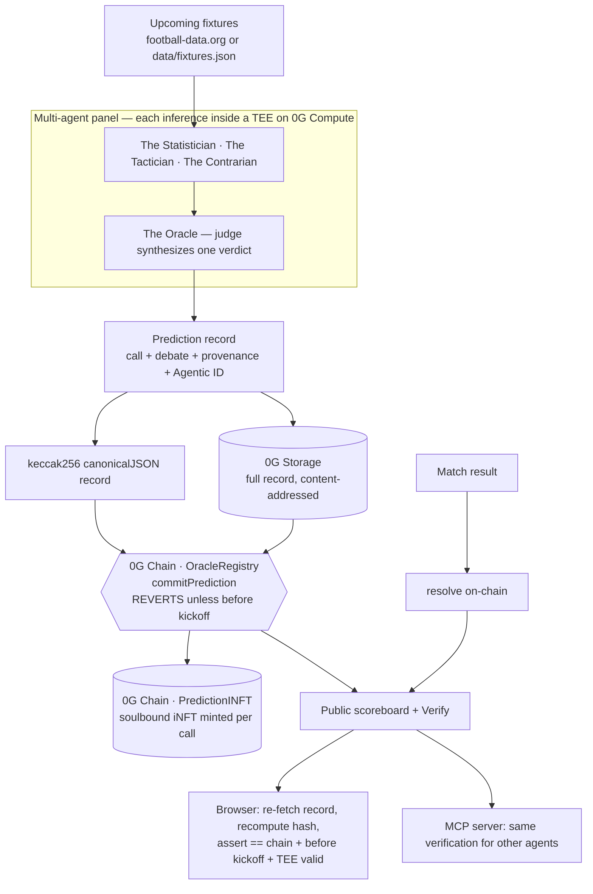

# The Oracle — Verifiable World Cup Predictions on 0G

**▶ Live demo: https://the-oracle-zoraks-projects.vercel.app** — open it, click **Verify**
on any prediction, and watch the integrity check run *in your own browser* (no wallet, no
install, nothing trusts our server).

> Mirror: https://0xzorak.github.io/zero-cup-oracle/ · Built for the **0G Zero Cup**.

---

## What it does

The Oracle is an **autonomous agent that predicts every World Cup match before kickoff** —
and makes each prediction impossible to fake or backdate.

For each upcoming match it:

1. **Reasons** through a panel of AI agents running inside **TEEs on 0G Compute**.
2. **Stores** the full prediction record (the call, the debate, the rationale) on **0G Storage**.
3. **Commits** a hash of that record on **0G Chain** — and the contract *rejects the commit
   unless it lands before kickoff*.
4. **Mints** a soulbound **iNFT** for the prediction, bound to the agent's on-chain identity.
5. After the match, **resolves** the result on-chain and updates a public accuracy scoreboard.

The website lets anyone re-derive the whole proof client-side. There's also a **"Beat the
Oracle"** game, an **"Ask the Oracle"** chat, and an **MCP server** so other AI agents can
read and verify the Oracle's record directly.

---

## The problem it solves

**Anyone can claim they predicted a result — after the fact.** Screenshots are faked,
timestamps are edited, tipsters quietly delete their misses. There is no way to trust an AI
prediction track record, because there's no proof the prediction (a) was really produced by
the model, (b) wasn't tampered with, and (c) existed *before* the outcome was known.

The Oracle splits the trust problem into two claims and proves them separately:

| Claim | What proves it |
|---|---|
| **Integrity** — "this exact prediction was produced by a genuine model in a TEE, untampered, before kickoff" | **0G** — TEE-signed inference + content hash committed on-chain before the block timestamp of kickoff |
| **Quality** — "the predictions are actually good" | the **public scoreboard**, earned over time on a record nobody can edit |

Because the commit must mine **before kickoff** (enforced in Solidity) and the record is
content-addressed on 0G Storage, the track record is **append-only and un-fakeable**. The
honest losses stay on-chain right next to the wins.

---

## Architecture

0G is load-bearing in three places — compute, storage, and chain are all essential, not
decorative.



### The 0G pillars

- **0G Compute (TEE inference).** Predictions are produced inside a Trusted Execution
  Environment; the response carries a signature the broker verifies (`processResponse`). This
  proves the model genuinely produced the output, untampered. ([src/broker/compute.ts](src/broker/compute.ts))
- **0G Storage.** The full record lives on 0G Storage, content-addressed by a root hash. The
  browser fetches it back over the public gateway. ([src/broker/storage.ts](src/broker/storage.ts))
- **0G Chain.** A thin Solidity registry stores only `keccak256(canonicalJSON(record))` plus
  the storage root, and **enforces the pre-kickoff guarantee**. ([contracts/src/OracleRegistry.sol](contracts/src/OracleRegistry.sol))

### The agents

The Oracle isn't one model — it's a **panel**. Three analyst agents (The Statistician, The
Tactician, The Contrarian) each reason in their own TEE inference, then a **judge** ("The
Oracle") weighs the disagreement and commits one verdict. The whole debate is stored on 0G
and shown in the Verify card. ([src/agent/panel.ts](src/agent/panel.ts))

### On-chain identity & provenance

- **0G Agentic ID** — the agent publishes a signed identity card to 0G Storage and binds
  `did:0g:<wallet>` into every record, so the author is committed on-chain with the call.
- **Prediction iNFTs** — a soulbound ERC-721 ([PredictionINFT.sol](contracts/src/PredictionINFT.sol))
  mints one **non-transferable** token per prediction. Its `tokenURI` resolves to the full
  record on 0G Storage; it stores the `storageRoot` + `recordHash`. A prediction's provenance
  belongs to the agent that made it and can't be traded away.

### Why it can't be faked

- The prediction is produced **inside a TEE** with a verifiable signature — not just our word.
- Only the **hash** goes on-chain; the full record is content-addressed on 0G Storage.
- `commitPrediction` **reverts unless it mines before kickoff** — the block timestamp is the
  proof of "called it first."
- The frontend (and the MCP server) **re-derive everything client-side**, trusting nothing on
  our server.

---

## How to use it

### As a visitor — just open the site

No install, no wallet, no keys. Open the [live demo](https://the-oracle-zoraks-projects.vercel.app),
browse the **Upcoming / Verified** tabs, and click **Verify** on any prediction. Your browser
fetches the record from 0G Storage, recomputes the hash, and checks it against the chain —
live, in front of you. Try **Beat the Oracle** (pick the matches yourself, then see its
on-chain call) and **Ask the Oracle** (chat about any call).

### As an operator — run the agent

The operator runs the agent that *produces* predictions. Needs Node 22+ and a funded 0G
testnet wallet; host it on any always-on box.

```bash
npm install
cp .env.example .env        # fill in PRIVATE_KEY (a funded 0G testnet wallet)

# 1. De-risk the hard part FIRST — wallet → ledger → TEE inference → verify:
npm run probe:tee           # want: teeSignatureValid: true

# 2. Deploy the contracts (needs Foundry — https://getfoundry.sh):
cd contracts && forge test
forge script script/Deploy.s.sol     --rpc-url og_testnet --broadcast --private-key $PRIVATE_KEY --legacy --gas-price 4000000007
forge script script/DeployINFT.s.sol --rpc-url og_testnet --broadcast --private-key $PRIVATE_KEY --legacy --gas-price 4000000007
#    paste the printed addresses into .env (ORACLE_CONTRACT_ADDRESS, INFT_CONTRACT_ADDRESS)

# 3. Run one tick of the full pipeline (predict → store → commit → mint):
npm run agent -- --once --all   # --all bypasses the 6h kickoff window for testing
npm run agent -- --resolve      # resolve finished matches (updates on-chain accuracy)

# 4. Or run the autonomous loop (predict every 10 min, resolve every 15 min):
npm run agent

# 5. Serve the public scoreboard locally:
cd frontend && python3 -m http.server 8099   # then open http://localhost:8099
```

**Live fixtures:** set `FOOTBALL_API_KEY` (free at football-data.org) to predict real
matches. With no key, the agent uses `data/fixtures.json` / `data/results.json` — enough to
demo the whole loop offline. **Social:** set the four `X_*` OAuth 1.0a creds to auto-post the
pre-kickoff call and post-match receipt to X; leave them blank and the agent dry-runs (prints
the tweet, never breaks the loop).

To ship the site: deploy the static `frontend/` folder to Vercel / Netlify / Cloudflare Pages
and point `frontend/config.js` at your deployed contract addresses. That URL is all a visitor
ever needs.

### As another agent — the MCP server

Any MCP client (Claude Desktop, Cursor, another agent) can read **and independently verify**
the Oracle's record. The read/verify tools need **no private key** and default to the live
deployed contract, so they run with zero config.

```bash
npm run mcp        # stdio MCP server
```

| Tool | What it does | Needs a key? |
|---|---|---|
| `oracle_get_scoreboard` | total / resolved / correct / accuracy, straight from 0G Chain | no |
| `oracle_list_predictions` | every committed call (on-chain fields + iNFT token id) | no |
| `oracle_get_prediction` | one call + its full record from 0G Storage (teams, debate, rationale) | no |
| `oracle_verify_prediction` | re-fetch the record, recompute the hash, assert it equals the on-chain commit **+** committed before kickoff **+** every agent's TEE signature valid | no |
| `oracle_predict_match` | run the TEE panel and commit a fresh prediction on-chain before kickoff | **yes** (`PRIVATE_KEY` + funded wallet) |

**Claude Desktop / Cursor** — add to your MCP config (absolute path):

```json
{
  "mcpServers": {
    "the-oracle": { "command": "npx", "args": ["tsx", "/ABSOLUTE/PATH/TO/mcp/server.ts"] }
  }
}
```

**Claude Code** auto-loads the repo-local [.mcp.json](.mcp.json). Then ask: *"Verify the
Oracle's prediction #0"* and the integrity proof comes back.

---

## Repo layout

```
src/
  broker/compute.ts     # 0G Compute Direct path + TEE verification (the hard part)
  broker/storage.ts     # 0G Storage upload (incl. the submit-ABI shim, see note)
  broker/contract.ts    # ethers client for the OracleRegistry
  broker/inft.ts        # ethers client for the Prediction iNFT (mint + reads)
  data/football.ts      # football-data.org v4 adapter (fixtures + results)
  agent/panel.ts        # the multi-agent debate: 3 analysts + a judge, each in a TEE
  agent/predict.ts      # personas + robust prediction parser (strict + lenient)
  agent/predictMatch.ts # full pre-kickoff pipeline for one match
  agent/resolve.ts      # post-match resolution → updates on-chain accuracy
  agent/identity.ts     # 0G Agentic ID — publishes the agent identity card
  agent/loop.ts         # node-cron scheduler (predict + resolve), idempotent
  canonical.ts          # deterministic JSON + keccak256 (the browser must match this)
  scripts/probe-tee.ts  # ⚠️ run this FIRST — de-risks the TEE path standalone
  scripts/backfill-inft.ts # mint iNFTs for predictions already committed
contracts/
  src/OracleRegistry.sol # thin registry + scoreboard, accuracy in basis points
  src/PredictionINFT.sol # soulbound ERC-721 — one iNFT per prediction, bound to the Agentic ID
frontend/
  index.html            # Windows-XP "Oracle OS" desktop (blur backdrop on popups)
  app.js                # chain reads + client-side Verify modal (shows the panel debate)
  game.js               # "Beat the Oracle" pick'em game
  chat.js               # "Ask the Oracle" — client-side agent over the stored records
  config.js             # contract addresses, RPC, 0G gateway + explorers (no keys)
mcp/
  server.ts             # MCP server — read + independently-verify the Oracle from any agent
```

---

## Deployed (0G Galileo testnet · chain id 16602)

| | Address |
|---|---|
| OracleRegistry | `0xBdA8083aCCf45Fe5b838936C94D53a91042D9Bbb` |
| PredictionINFT (soulbound) | `0x92DCcfA420397bAF3e60A3a673c6c1cC9677e9cC` |
| Agent / Agentic ID | `0xaa61388fbDd6e557a8Fb2E02393B311AcEA27B6f` (`did:0g:0xaa61…7B6f`) |

| | Testnet (Galileo) | Mainnet |
|---|---|---|
| RPC | `https://evmrpc-testnet.0g.ai` | `https://evmrpc.0g.ai` |
| Storage gateway | `https://indexer-storage-testnet-turbo.0g.ai` | — |

---

## Building on 0G — the honest field report

Shipping this end-to-end on 0G surfaced real friction (an out-of-date Storage SDK, a thin
testnet compute layer, gas/chain-id quirks). Rather than hide it, [**HACKING.md**](HACKING.md)
documents every gotcha as *symptom → cause → fix*, with the fix linked in this repo — and a
fair accounting of what 0G genuinely got right. If you're building on 0G, start there.

## Known caveat — 0G Storage SDK is behind the deployed contract

The published `@0glabs/0g-ts-sdk` (0.3.3, latest) calls the old `submit(Submission)`
selector, but the live Galileo Flow contract upgraded `submit` to wrap the struct with the
sender address (`submit((Submission,address))`, selector `0xbc8c11f8`). The old call reverts
with a bare `require(false)`. Only the function changed — the `Submit` event and segment
upload are identical — so [storage.ts](src/broker/storage.ts) builds the uploader the SDK
way, then overrides just the `submit` call with the correct ABI. Remove the shim once 0G
ships an SDK that targets the current contract.

## Honest caveats

- **Result resolution trusts an off-chain data feed.** The source is recorded in every record
  (`dataSources`). Full trustlessness needs a decentralized score oracle — named as future work.
- **TEE verification proves integrity, not correctness.** It proves the model genuinely
  produced the prediction untampered; it does *not* prove the call is good. The public
  scoreboard earns that, over time. We don't blur the two.
- **Keys stay server-side.** The agent's private key funds compute and signs commits — env
  vars only, never the frontend.
